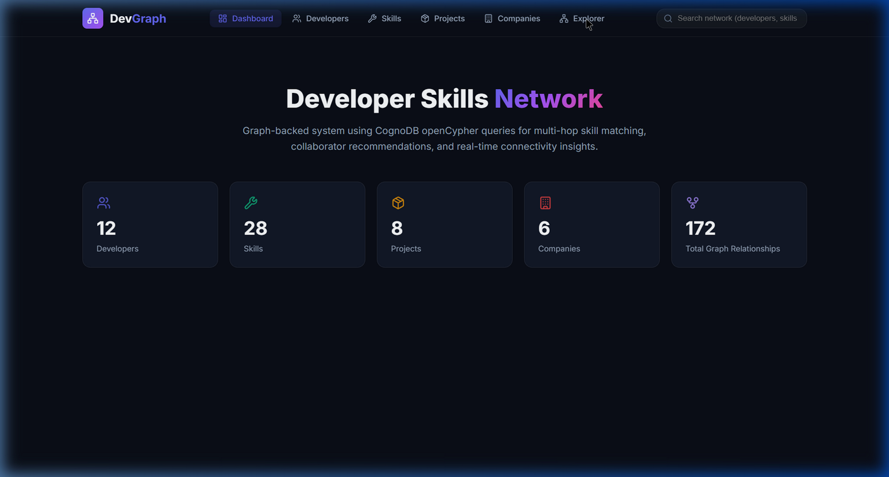
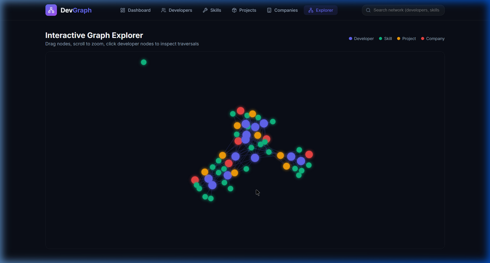
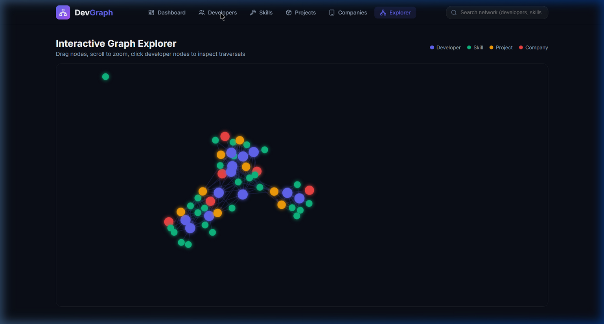
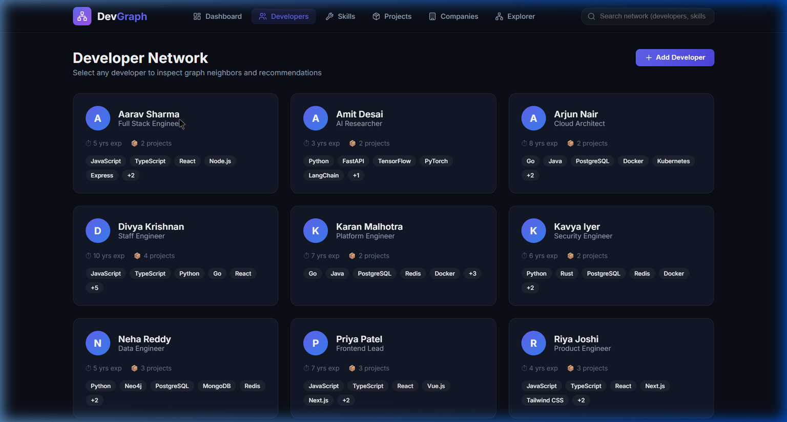
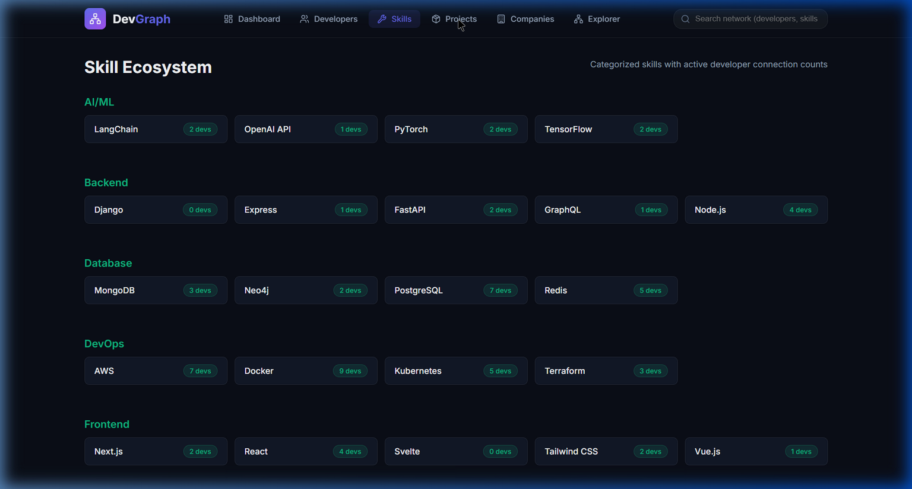
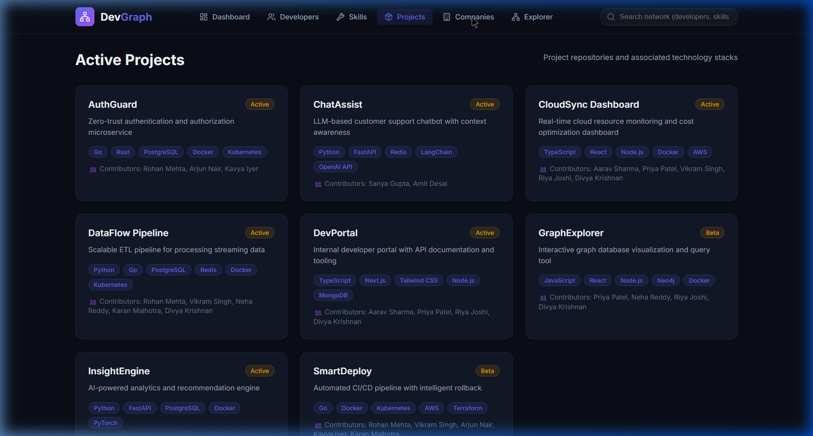
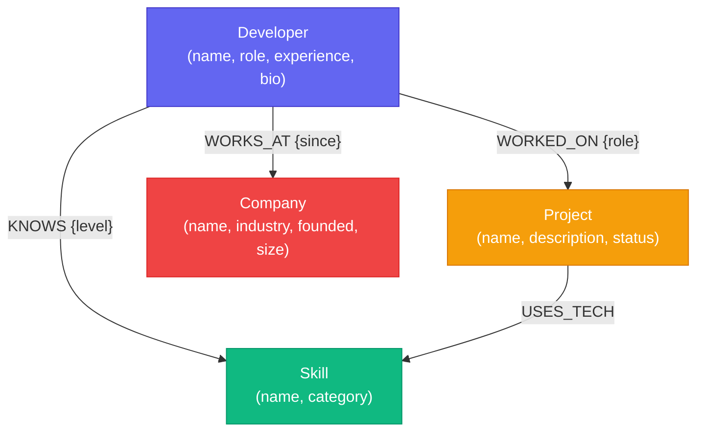
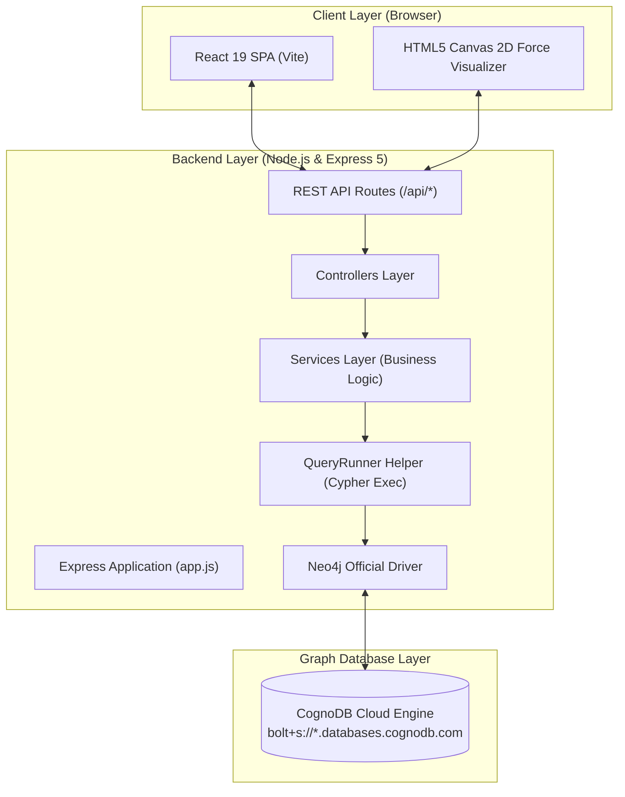

# DevGraph – Developer Skills Network

A full-stack graph database application that models the relationships between **developers**, **skills**, **projects**, and **companies**. Built with **CognoDB** (Neo4j-compatible openCypher engine) as the graph database layer and a modern **React 19 (Vite)** single-page application frontend.

---

## 📸 Screenshots

| 📊 Dashboard & Metrics | 🕸️ Interactive 2D Graph Explorer |
|:----------------------:|:---------------------------------:|
|  |  |

| 👥 Developer Network & Directory | 🔍 2-Hop Traversal & Recommendations |
|:--------------------------------:|:-------------------------------------:|
|  |  |

| 📁 Active Projects Ecosystem | 🏢 Tech Companies Network |
|:----------------------------:|:-------------------------:|
|  |  |

---

## ✨ Features

- 🕸️ **Interactive 2D Force-Directed Graph Visualizer:** Physics-based HTML5 canvas graph visualizer allowing users to drag nodes, zoom, pan, and click nodes to inspect graph connections in real time.
- 🔀 **Multi-Hop Traversal Queries:** 
  - **2-Hop Skill Sharing:** Identifies developers who share the highest skill overlap with a target developer (`Dev → KNOWS → Skill ← KNOWS ← Dev`).
  - **3-Hop Collaborator Recommendations:** Recommends skills based on what project collaborators know (`Dev → WORKED_ON → Project ← WORKED_ON → Colleague → KNOWS → Skill`).
  - **Shortest Path Connection Finder:** Computes shortest paths between any two developers using native `shortestPath()` graph algorithms.
- ⚡ **Global Search & Filter:** Instant search across developers, skills, projects, and companies with category filter tags.
- 📊 **Real-Time Network Dashboard:** Live metrics displaying node counts, relationship density, top skills, and developer distributions.
- 🛡️ **Clean MVC Architecture:** Strict separation of concerns (Routes → Controllers → Services → QueryRunner → Neo4j Driver).
- 🎨 **Dark Mode Glassmorphic UI:** Modern responsive dark UI built with CSS custom properties, backdrop blur filters, and micro-interactions.

---

## 🛠️ Tech Stack

### Database Layer
- **CognoDB Cloud:** Fully managed Neo4j-compatible openCypher graph database instance.
- **Neo4j Official Driver (`neo4j-driver` v6):** Connection pooling, session management, and 100% parameterized Cypher query execution.

### Backend (Node.js & Express 5)
- **Node.js (v18+):** Runtime environment.
- **Express 5:** Fast, unopinionated REST API routing and static frontend serving.
- **dotenv & CORS:** Environment configuration and cross-origin resource handling.

### Frontend (React 19 & Vite)
- **React 19 (Vite):** Modern client side rendering framework.
- **HTML5 Canvas:** High-performance 2D force-directed graph canvas rendering.
- **Lucide Icons:** SVG icons for UI navigation and badge indicators.
- **Vanilla CSS3:** Custom tokenized design system featuring dark glassmorphism, responsive grid layouts, and smooth animations.

---

## 📐 Graph Data Model

The network graph consists of **54 nodes** and **172+ relationships**:

```
(:Developer) -[:KNOWS {level}]-> (:Skill {name, category})
(:Developer) -[:WORKS_AT {since}]-> (:Company {name, industry, founded, size})
(:Developer) -[:WORKED_ON {role}]-> (:Project {name, description, status})
(:Project)   -[:USES_TECH]-> (:Skill)
```

### Mermaid Data Model Diagram



---

## 🏗️ Architecture & Flow

### Component & Data Flow Diagram



### Project Structure

```
wexa-graph-app/
├── screenshots/                   # Application screenshots for documentation
│   ├── dashboard.png
│   ├── graph-explorer.png
│   ├── developer-network.png
│   ├── developer-details.png
│   ├── active-projects.png
│   └── tech-companies.png
├── src/
│   ├── config/database.js         # CognoDB driver setup & connection management
│   ├── helpers/queryRunner.js     # Reusable read/write Cypher query helpers
│   ├── middleware/errorHandler.js # Centralised error handler + asyncHandler wrapper
│   ├── controllers/               # Request/response controllers
│   ├── services/                  # Business logic & parameterized Cypher queries
│   ├── routes/                    # REST API routes (/api/*)
│   └── app.js                     # Express app configuration & static React serving
├── frontend/                      # Production React SPA
│   ├── src/
│   │   ├── api/                   # Axios API service layer
│   │   ├── components/            # Atomic UI & Interactive Force Graph Canvas
│   │   ├── features/              # Modals, Cards, Add Developer form
│   │   ├── pages/                 # SPA route views (Dashboard, Devs, Skills, Projects, Companies, Explorer)
│   │   └── styles/                # CSS design system (Dark mode, glassmorphism)
├── seed/                          # UNWIND bulk data seeding scripts
├── server.js                      # Application entrypoint & graceful shutdown handler
└── package.json
```

---

## ❓ Why a Graph Database?

A developer skills network is inherently a **graph problem**. The interesting questions are all about connections:

| Question | Graph Approach | Relational Approach |
|----------|---------------|---------------------|
| "Who shares the most skills with me?" | Single 2-hop traversal: `Dev→KNOWS→Skill←KNOWS←Dev` | Multi-table JOIN with GROUP BY across a junction table |
| "What skills should I learn next?" | 3-hop traversal: `Dev→WORKED_ON→Project←WORKED_ON←Colleague→KNOWS→Skill` | 3+ self-JOINs with subquery exclusions |
| "How are two developers connected?" | `shortestPath()` — native graph primitive | Recursive CTEs or application-level BFS — complex and slow |
| "Show the entire network" | `MATCH (n)-[r]->(m)` — single query | Multiple queries across many tables, assembled in code |

A relational schema would require **junction tables** for every many-to-many relationship (`developer_skills`, `project_contributors`, `project_technologies`) and **recursive queries** for path-finding. The graph model makes these queries natural, readable, and performant.

---

## ⚡ Main Queries Explained

### 1. Similar Developers (2-hop traversal)
```cypher
MATCH (d1:Developer)-[:KNOWS]->(s:Skill)<-[:KNOWS]-(d2:Developer)
WHERE elementId(d1) = $developerId AND d1 <> d2
WITH d2, COLLECT(DISTINCT s.name) AS sharedSkills, COUNT(DISTINCT s) AS overlap
RETURN d2, sharedSkills, overlap ORDER BY overlap DESC
```
Finds developers who share the most skills with a given developer.

### 2. Skill Recommendations (3-hop traversal)
```cypher
MATCH (d:Developer)-[:WORKED_ON]->(p:Project)<-[:WORKED_ON]-(colleague)-[:KNOWS]->(s:Skill)
WHERE elementId(d) = $developerId AND NOT (d)-[:KNOWS]->(s)
RETURN s, COUNT(DISTINCT colleague) AS recommendedBy
```
Recommends skills based on what project collaborators know but the developer doesn't.

### 3. Connection Path (shortestPath)
```cypher
MATCH path = shortestPath((d1:Developer)-[*..6]-(d2:Developer))
WHERE elementId(d1) = $dev1Id AND elementId(d2) = $dev2Id
RETURN nodes(path), relationships(path)
```
Finds the shortest path connecting any two developers through the graph.

---

## 🚀 Setup & Run Instructions

### Prerequisites
- Node.js 18+
- A CognoDB Cloud instance (free tier from [console.cognodb.com](https://console.cognodb.com))

### 1. Configure Environment
Create `.env` in the root directory:
```env
DB_URI=bolt+s://<instance-id>.databases.cognodb.com
DB_USERNAME=cognodb
DB_PASSWORD=<your-password>
PORT=5000
```

### 2. Install Dependencies
```bash
# Install backend dependencies
npm install

# Install frontend dependencies
cd frontend && npm install && cd ..
```

### 3. Seed the Database
```bash
npm run seed
```

### 4. Build Frontend & Run
```bash
# Build React frontend
cd frontend && npm run build && cd ..

# Start Production Server
npm start
```
Open [http://localhost:5000](http://localhost:5000) in your browser.

---

## ✅ Submission Checklist (Wexa AI Assignment 2)

- [x] **Screenshots Included:** 6 high-resolution application screenshots embedded in README.
- [x] **Mermaid Data Model Diagram:** Full graph database node & relationship schema visualized.
- [x] **Mermaid Architecture Diagram:** Detailed end-to-end client, server, and graph database flow.
- [x] **Features Section:** Comprehensive list of visual, algorithmic, and architectural capabilities.
- [x] **Tech Stack Section:** Explicit technology breakdown across DB, Backend, and Frontend layers.
- [x] **Data Model & Seed Script:** 54 nodes, 172+ relationships seeded via UNWIND.
- [x] **Multi-Hop Traversal Queries:** 2-hop skill sharing & 3-hop collaborator skill recommendation.
- [x] **Parameterized Cypher:** 100% parameterised via official `neo4j-driver`.
- [x] **Clean Architecture:** Controller-Service-QueryRunner MVC pattern.
- [x] **Graceful Error Handling:** Centralized 503 database unreachable mapping.
- [x] **Interactive UI/UX:** React 19 SPA with 2D Force-Directed Graph Visualizer.
